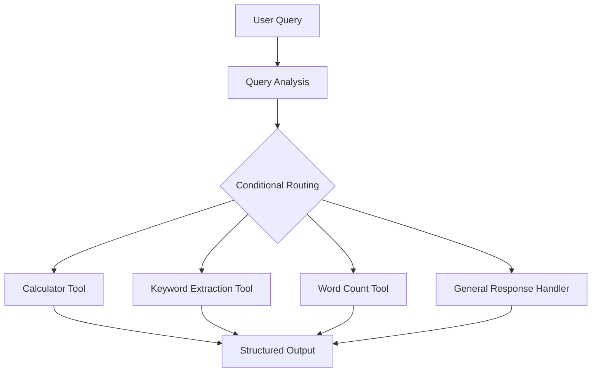

# Assignment 08 – Single Agent Pipeline

## Overview

This assignment was completed as part of the **Celebal Excellence Internship (CEI) 2026** under the **Data Science (DS001)** track at **Celebal Technologies**.

The objective of this assignment was to build a small **Single-Agent Smart Assistant** capable of understanding user queries, determining the appropriate type of request, routing the query to the corresponding tool, and returning a structured response.

The project demonstrates fundamental concepts of **Agentic AI**, including tool-based execution, conditional routing, error handling, logging, and interactive agent workflows.

---

## Problem Statement

**Build an Agentic AI Pipeline using a single-agent system.**

The implemented agent is designed to:

- Understand different types of user queries
- Determine the appropriate action using rule-based routing
- Call the relevant tool when required
- Handle general queries directly
- Return structured JSON-style responses
- Provide an interactive mode for user queries

---

## Agent Capabilities

The agent supports the following query types:

| Query Type | Handler |
|------------|---------|
| Mathematical calculations | Calculator Tool |
| Keyword extraction | Keyword Extraction Tool |
| Word counting | Word Count Tool |
| General queries | General Response Handler |

The routing logic checks the rules in sequence, and the **first matching rule determines the route**. Each tool performs a specific task, keeping the system modular and easy to extend.

---

## Agent Workflow

The basic workflow of the system is:



---

## Interactive Mode

The notebook includes an interactive mode that allows users to enter their own queries.

Users can continue interacting with the agent until they enter:

```text
exit
```

The notebook can be executed from top to bottom in **Google Colab or Jupyter Notebook**.

---

## Example Queries

Example queries handled by the system include:

```text
Calculate 20 + 5
```

```text
Extract keywords from Artificial Intelligence is transforming industries
```

```text
Count the words in this sentence please
```

```text
What is machine learning?
```

The agent identifies the appropriate route and returns the result in the predefined structured format.

---

## Concepts Covered

Through this assignment, the following Agentic AI concepts were explored:

- Single-Agent Systems
- Agent Pipelines
- Stateful Directed Graphs
- Nodes and Edges
- Conditional Routing
- Tool-Based Agents
- Sequential Tool Calls
- Parallel Tool Calls
- Cycles and Retry Loops
- JSON Schema Tools
- Error Handling
- Logging and Monitoring
- Trajectory Evaluation
- Task Completion Rate
- Cost Metrics
- Structured Agent Outputs

---

## Files

| File | Description |
|------|-------------|
| `week8_subrata_kumar_dey.ipynb` | Completed Week 8 Single Agent Pipeline notebook |
| `quiz_answers.md` | Answers to the Week 8 Single Agent Systems & Agent Pipelines quiz |
| `requirements.txt` | Environment and dependency information |
| `Assignment_08_Problem_Statement.ipynb` | Assignment problem statement |
| `Week_08_Quiz.pdf` | Week 8 quiz document |
| `README.md` | Project documentation |

---

## Requirements

The project uses only the **Python standard library**.

No additional third-party packages are required.

The implementation primarily uses built-in Python modules such as:

- `re`
- `logging`

The notebook can be executed using **Python 3** in:

- Google Colab
- Jupyter Notebook

---

## Learning Outcomes

This assignment provided practical experience with:

- Designing a basic agentic AI workflow
- Building tool-based single-agent systems
- Implementing rule-based conditional routing
- Structuring tool inputs and outputs
- Handling errors in agent workflows
- Logging agent decisions
- Designing modular tools
- Understanding agent workflow architecture
- Evaluating agent trajectories
- Understanding task completion and cost metrics

---

## Author

**Subrata Kumar Dey**

Data Science Intern – CEI 2026

B.Tech CSE (Cyber Security & Privacy)

DIT University
